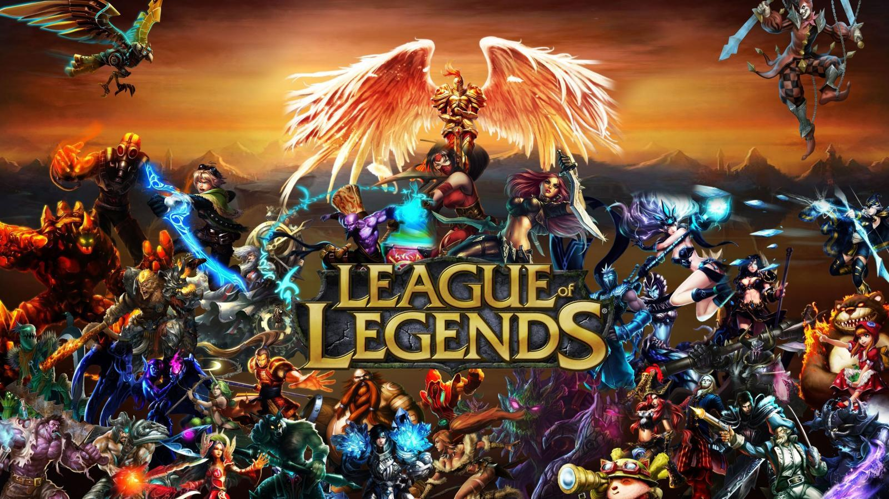
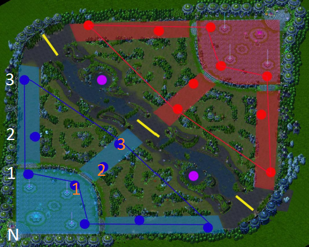
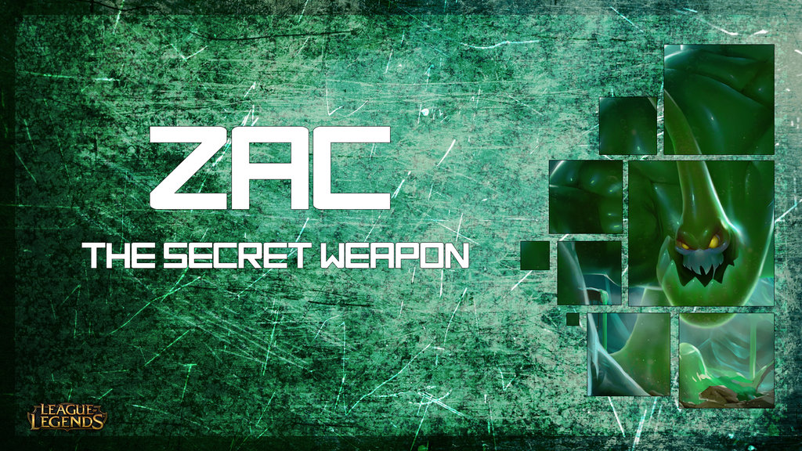

<link rel="stylesheet" href="./main.css">

# Overview
League of Legends is a popular multiplayer online battle arena (MOBA) video game. Two teams of five players control characters called "champions" and compete to complete objectives. Teams begin the game on opposite corners of a sizeable map. To win the game, they must destroy a sequence of enemy turrets, invade the enemy base, and destroy the enemy nexus.

During the game, players engage in complex strategic actions to increase the strength of their champions, accomplish objectives, and eliminate players on the enemy team. Games tend to last between 30-45 minutes, although some may be much shorter or longer. League of Legends has over 100 million unique monthly players, and billions of League of Legends games have been played. Each game generates a tremendous amount of data, which is archived and made available by Riot (the company behind League of Legends) to enable players to track the progress of themselves and their friends. 

**I propose to use neural networks to predict the outcome of a League of Legends match based upon player performance in prior games.** Due to the tremendous amount of data available, I anticipate that a network trained on a sufficiently large dataset can achieve a high accuracy at this prediction task.

## Approach
Riot makes data from all League of Legends matches available to developers through the [Riot Games API](https://developer.riotgames.com/). A Python interface is available [here](https://github.com/pseudonym117/Riot-Watcher). I will create a Python script to analyze League of Legends games and collect prior game data for each player on the team. This data will be used to train a neural network to predict whether a team will win or lose based upon their match history.

I will implement a multi-layer, fully-connected neural network using Google's [Tensorflow](https://www.tensorflow.org/) library. At least 1,000 games will be included in the training set, and over 80,000 games will be represented in the prior game data from player histories. 

Player performance data will be measured by 50 variables for each match. Some of these parameters will include:
- Kills
- Assists
- Deaths
- Damage to Objectives
- Damage to Turrets
- Damage that is Self-Mitigated
- Gold Earned
- Gold Spent
- Neutral minions killed
- Physical Damage Dealt
- Magical Damage Dealt
- Double, Triple, Quadra, and Pentakills
- Time applying Crowd Control to Others
- Wards Placed
- Victory or Defeat

Additional performance metrics will be drawn from match timelines, such as damage taken per minute, gold acquired per minute, and experience points gained per minute. 

### Image Sources
[Champions](http://www.siliconbeat.com/2015/02/02/quoted-league-of-legends-as-online-psych-experiment/)
[Map](http://www.scholarlygamers.com/feature/2017/04/28/design-choices-league-legends-iconic-map-dictate-tempo-game/)
[Zac](https://giantking.deviantart.com/art/LoL-Zac-Wallpaper-458640460)
